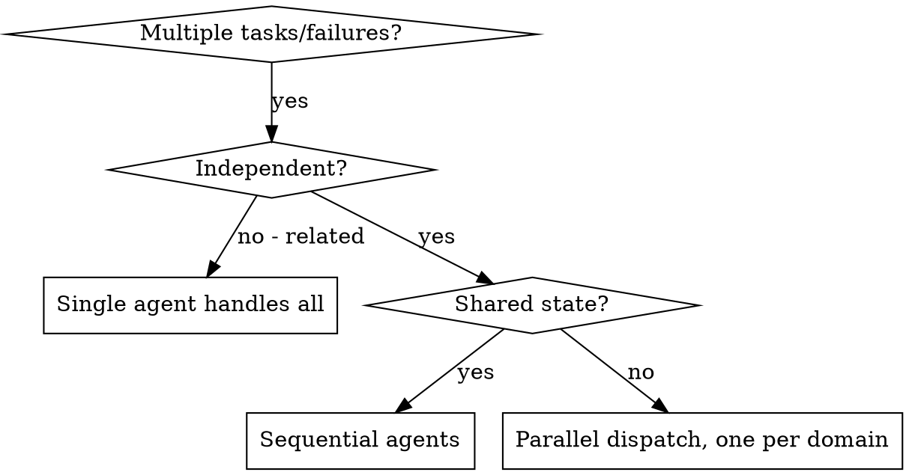

# Dispatching Parallel Agents

**Dispatch parallel subagents readily; use subagents frequently.** Reach for them whenever work splits into independent pieces — don't hoard work in your own context. Each runs in an isolated context you construct exactly and never inherits your session history. You decide precisely what it sees, which keeps it focused and preserves your own context for coordination.

**Core principle:** one agent per independent problem domain, run concurrently. Parallelize *independent* work (disjoint files, ideally isolated worktrees); keep coupled or shared-state tasks sequential.

## Core pattern

This is the primary procedure. Do these four steps in order. For straightforward independent-task fan-out, this is all you need — do not reach for the advanced section below.

### Step 1 — Judge whether the problems are truly independent

Before dispatching anything, confirm the work actually splits into independent pieces. Two pieces are independent only if **all** of these hold:
- Each can be understood and fixed without context from the others.
- They do not share state.
- They will not edit the same files or contend for the same resources.

Group the work by what is broken or what must change, for example:
- File A tests: tool approval flow
- File B tests: batch completion behavior
- File C tests: abort functionality

If two "domains" touch the same files, or one fix could change the other's behavior, they are **one** domain — merge them or run them sequentially. Do not parallelize them.



**Parallelize when:**
- 3+ test files failing with different root causes
- Multiple subsystems broken independently
- Each problem can be understood without context from the others
- No shared state between the pieces of work

**Do NOT parallelize when:**
- Failures are related — fixing one may fix others; investigate together first
- Understanding requires seeing the whole system at once
- You don't yet know what's broken (exploratory debugging — investigate first, then split)
- Agents would edit the same files or contend for the same resources

### Step 2 — Dispatch one subagent per independent problem, in parallel

Issue **all** the dispatches in the *same* response so they run concurrently. Multiple dispatch calls in one response run in parallel; one dispatch per response runs sequentially.

```text
Subagent (general-purpose): "Fix agent-tool-abort.test.ts failures"
Subagent (general-purpose): "Fix batch-completion-behavior.test.ts failures"
Subagent (general-purpose): "Fix tool-approval-race-conditions.test.ts failures"
# All three run at once.
```

### Step 3 — Write each prompt self-contained, with an IGNORE blocklist

The agent has none of your session's knowledge, and may be a weaker/cheaper model (e.g. Haiku) that cannot infer what you leave out. Every prompt must stand on its own and carry three things:

1. **IGNORE blocklist** — name the paths the agent must not read or touch, so it stays cheap and on-target instead of re-globbing the world: `node_modules/`, `venv/`, `dist/`, `build/`, lockfiles, vendored dependencies, generated code, and model/weight blobs (`*.gguf *.safetensors *.bin`).
2. **Specific domain context, inlined** — everything needed to understand the problem: the named file or subsystem, the exact error messages and test names, relevant interfaces, your read of the likely cause, and known gotchas. Hand *bulk* over as a file path for the agent to read; never paste bulk into the prompt.
3. **Structured expected output** — state exactly what to return (root cause + the changes made + the test/command results), so you can integrate without a second round-trip.

Example prompt:

```markdown
Fix the 3 failing tests in src/agents/agent-tool-abort.test.ts:

1. "should abort tool with partial output capture" - expects 'interrupted at' in message
2. "should handle mixed completed and aborted tools" - fast tool aborted instead of completed
3. "should properly track pendingToolCount" - expects 3 results but gets 0

These are timing/race condition issues. Your task:
1. Read the test file and understand what each test verifies
2. Identify root cause - timing issue or actual bug?
3. Fix by replacing arbitrary timeouts with event-based waiting, fixing
   abort bugs if found, or adjusting expectations if behavior changed.

Do NOT just increase timeouts — find the real issue.
Ignore: node_modules/, venv/, dist/, build/, lockfiles, generated code, weight blobs.
Touch only this test file and the abort implementation it covers.

Return: root cause, the changes you made, and the test run output.
```

**Common mistakes:**
- ❌ "Fix all the tests" → agent gets lost. ✅ name the one file/domain.
- ❌ "Fix the race condition" → agent doesn't know where. ✅ paste the errors and test names.
- ❌ no constraints → agent refactors everything. ✅ "fix tests only, don't touch production code."
- ❌ "Fix it" → you don't know what changed. ✅ "return root cause + changes."

### Step 4 — After agents return, VERIFY yourself — do NOT trust their success reports

An agent reporting "done" is a claim, not evidence. A clean summary over a broken diff is exactly the failure this gate exists to catch. After agents return, do all of this yourself before integrating:

1. **Read each summary** — understand what each agent says it changed.
2. **Check the VCS diff yourself** — run `git diff` / `git status` for the files each agent touched. The diff is the truth; the summary is only the agent's account of it. Never accept a "success" report without looking at the actual diff.
3. **Check for conflicts** — did two agents edit the same code?
4. **Run the full suite** — confirm all fixes work together, not just in isolation.
5. **Spot check** — agents make systematic errors; verify the actual behavior, not the report.

### Worked example

**Scenario:** 6 test failures across 3 files after a major refactor.

- agent-tool-abort.test.ts: 3 failures (timing issues)
- batch-completion-behavior.test.ts: 2 failures (tools not executing)
- tool-approval-race-conditions.test.ts: 1 failure (execution count = 0)

**Step 1 — independent?** Yes: abort logic, batch completion, and race conditions don't share state.

**Step 2 — dispatch all three in one response → concurrent:**
```
Agent 1 → Fix agent-tool-abort.test.ts
Agent 2 → Fix batch-completion-behavior.test.ts
Agent 3 → Fix tool-approval-race-conditions.test.ts
```

**Results:**
- Agent 1: replaced timeouts with event-based waiting
- Agent 2: fixed event structure bug (threadId in wrong place)
- Agent 3: added wait for async tool execution to complete

**Step 4 — verify:** checked each diff, found no conflicts, ran the full suite green — 3 problems solved in the time of 1, zero conflicts between agent changes.

## Advanced patterns (reach for these only when the core isn't enough)

For straightforward independent-task fan-out, the core pattern above is sufficient — do not over-engineer. Reach for these only when the core genuinely cannot express the work.

### Async dispatch and long-lived agent reuse

- **Prefer async over blocking.** Don't stall waiting for each subagent to return before doing anything else. After fanning out, keep doing coordination work — read other files, plan the integration, or dispatch the next independent batch — and collect each result as it lands instead of blocking on the slowest one. The aim is **no idle orchestrator**.
- **Reuse a long-lived agent for sequential, related follow-ups.** Each dispatch returns an `agentId`. When a follow-up step is needed *within the same domain* (the fix uncovered a second bug; passing tests revealed a new failure), continue the *same* agent instead of spawning a fresh one — it already holds the domain context, so you skip rebuilding it and gain cache reads. Continue it by sending a new message to its `agentId`:

```text
# The first dispatch for the abort domain returned agentId "agent-abort-7f3".
SendMessage(agentId: "agent-abort-7f3"):
  "Those 3 tests pass now. A new failure surfaced in the same file:
   'should flush partial output on abort' — expects 2 chunks, got 1.
   Same scope and IGNORE rules as before. Return root cause + diff + test output."
# Fire this and go do other work while it runs — do not block on it.
```

Rule of thumb: **new independent domain → new agent (dispatch in parallel); sequential follow-up within a domain → continue the existing agent via its `agentId` with SendMessage.** Either way, don't block — issue the continuation, then keep coordinating.

### Multi-modal sweep

One domain, attacked from several independent angles at once. Use it to *understand* a domain fast when the angles don't share state.

Steps:
1. Pick 3 disjoint angles that produce non-overlapping outputs. A typical trio:
   - an `Explore` (read-only) recon agent that maps the code and reports structure,
   - a test-runner agent that runs the suite and reports failures verbatim,
   - a docs/usages agent that finds call sites and documentation.
2. Give each agent a scope it alone owns. Read-only agents may overlap on the same files freely; only writer agents need disjoint files.
3. Dispatch all three in one response so they run concurrently.

Example (one response, three dispatches):

```text
Subagent (Explore, read-only): "Map src/payments/. Return every exported
  function with file:line, who calls it, and the data types it touches.
  Ignore: node_modules/, dist/. Do not edit anything."
Subagent (general-purpose): "Run `npm test -- payments`. Return the full
  failure output verbatim — test name, expected, actual, stack. No analysis."
Subagent (general-purpose): "Find all call sites of chargeCard() across the
  repo plus any docs mentioning it. Return a file:line list + doc excerpts.
  Ignore: node_modules/, dist/. Read-only."
```

### Perspective-diverse verify

When a claim or change can fail multiple ways, dispatch fresh-context verifiers with different lenses in parallel: correctness, security, and does-it-actually-reproduce. Fresh-context verifiers prompted to *refute* outperform self-critique.

Steps:
1. State the claim to verify in one sentence.
2. Dispatch one verifier per lens, each with a fresh context (give it none of your reasoning), each told to assume the claim is false.
3. Accept the claim only for lenses where the verifier could *not* refute it and reproduced its logic chain from the code. Default any un-reproduced claim to "not real."

Refute-prompt template (fill the brackets):

```text
Claim: [state it in one sentence, e.g. "the retry loop in client.ts cannot deadlock"].
Assume this claim is FALSE; only accept it if you can reproduce its logic chain.
Reproduce it step by step from the code itself — not from my assertion. Actively
hunt for the input or sequence that breaks it.
Return exactly one of:
  - REFUTED: the concrete input/sequence that breaks it, with file:line.
  - CONFIRMED: the step-by-step logic chain you reproduced that proves it holds.
Ignore: node_modules/, dist/. Read-only.
```

Dispatch this template three times in one response with the lens swapped (correctness / security / does-it-reproduce).

### Loop-until-dry

For unknown-size discovery (how many broken call sites? how many dead configs?), don't guess the count up front and don't stop at the first batch. Sweep, act, then re-sweep until the sweep comes back empty.

Loop:
1. Dispatch a sweep agent that finds and returns *every* current instance of the target (e.g. every call site still using the old signature).
2. Act on what it returns — fix the instances directly, or dispatch fixer agents per the parallel rules above.
3. **Termination check:** dispatch the *same* sweep again. If it returns an empty result, stop. If it returns more, go back to step 2.

Example:

```text
# Iteration 1 — sweep
Subagent (general-purpose): "Search the repo for call sites of the old
  parseConfig(str) signature (single string arg). Return file:line for every
  match, or 'NONE' if there are none. Ignore: node_modules/, dist/. Read-only."
# → returns 11 sites. Fix them (directly or via fixer agents).

# Iteration 2 — same sweep again as the termination check
Subagent (general-purpose): "Search the repo for call sites of the old
  parseConfig(str) signature (single string arg). Return file:line for every
  match, or 'NONE'. Ignore: node_modules/, dist/. Read-only."
# → returns 'NONE'. The sweep is dry — stop.
```

Re-running the identical sweep is the termination condition: an empty result means dry.

### Author a reusable workflow for large fan-outs

When the fan-out is large, structured, or repeated, stop hand-sequencing dispatches and author a reusable workflow instead — see **maestro:dynamic-workflow-orchestration**.
