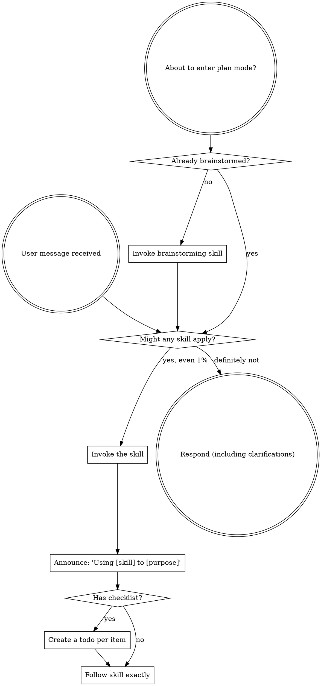

<SUBAGENT-STOP>
If you were dispatched as a subagent to execute a specific task, skip this skill.
</SUBAGENT-STOP>

<EXTREMELY-IMPORTANT>
If you think there is even a 1% chance a skill might apply to what you are doing, you ABSOLUTELY MUST invoke the skill.

IF A SKILL APPLIES TO YOUR TASK, YOU DO NOT HAVE A CHOICE. YOU MUST USE IT.

This is not negotiable. This is not optional. You cannot rationalize your way out of this.
</EXTREMELY-IMPORTANT>

## The Rule

**Invoke relevant or requested skills BEFORE any response or action** — before clarifying questions, before exploring the codebase, before "just checking" git or files. A 1% chance a skill applies means invoke it to check; if it turns out wrong for the situation, drop it.

## Instruction Priority

Skills override default system-prompt behavior, but **user instructions always win**:

1. **User's explicit instructions** (CLAUDE.md, GEMINI.md, AGENTS.md, direct requests) — highest
2. **Maestro skills** — override default behavior where they conflict
3. **Default system prompt** — lowest

If CLAUDE.md/GEMINI.md/AGENTS.md says "don't use TDD" and a skill says "always use TDD," follow the user. The user is in control. Instructions say WHAT, not HOW — "Add X" or "Fix Y" doesn't mean skip workflows.

## How to Access Skills

**Never read skill files manually with file tools** — always use your platform's skill-loading mechanism so the skill is properly activated.

**In Claude Code:** Use the `Skill` tool. When you invoke a skill, its content is loaded and presented to you — follow it directly.

**In Codex:** Skills load natively. Follow the instructions presented when a skill activates.

**In Copilot CLI:** Use the `skill` tool. Skills are auto-discovered from installed plugins.

**In Gemini CLI:** Skills activate via the `activate_skill` tool. Gemini loads skill metadata at session start and activates the full content on demand.

**In other environments:** Check your platform's documentation for how skills are loaded.

## Platform Adaptation

Skills speak in actions ("dispatch a subagent", "create a todo", "read a file") rather than naming any one runtime's tools. For per-platform tool equivalents and instructions-file conventions, see [claude-code-tools.md](references/claude-code-tools.md), [codex-tools.md](references/codex-tools.md), [copilot-tools.md](references/copilot-tools.md), [gemini-tools.md](references/gemini-tools.md), [pi-tools.md](references/pi-tools.md), and [antigravity-tools.md](references/antigravity-tools.md). Gemini CLI users get the tool mapping loaded automatically via GEMINI.md.

## Skill Priority

When multiple skills apply, use this order: **process → workflow → implementation.**

1. **Process** (`brainstorming`, `systematic-debugging`) — determine HOW to approach the task.
2. **Workflow** (`dynamic-workflow-orchestration`) — when work is large, structured, or repeated, author/run a reusable workflow instead of hand-sequencing subagents.
3. **Implementation** (`frontend-design`, `mcp-builder`) — guide execution.

The workflow tier applies only to **large, structured, or repeated work** — skip it for small one-offs.

- "Let's build X" (large or multi-step) → brainstorming → dynamic-workflow-orchestration → implementation.
- "Add one small helper" (small, one-off) → brainstorming → implementation (no workflow tier).
- "Fix this bug" → systematic-debugging → (dynamic-workflow-orchestration only if the fix is large or repeated) → domain skills.

## In High-Autonomy / Ultracode Runs

For substantive work, default to `dynamic-workflow-orchestration` and parallel subagents. Parallelize **independent** tasks (disjoint files, ideally isolated worktrees); keep coupled/shared-state work sequential. Be terse to the user; think hard, say little.

**When you have enough information to act, act.** The skill check is mandatory; analysis paralysis is not. Don't loop on clarifying questions or re-planning once the path is clear, and don't stop between tasks to check in — stop only on a blocker you can't resolve, genuine ambiguity, or completion.

## Red Flags

These thoughts mean STOP — you're rationalizing past the skill check:

| Thought | Reality |
|---------|---------|
| "This is just a simple question" | Questions are tasks. Check for skills. |
| "I need more context first" | Skill check comes BEFORE clarifying questions. |
| "Let me explore the codebase first" | Skills tell you HOW to explore. Check first. |
| "I can check git/files quickly" | Files lack conversation context. Check for skills. |
| "Let me gather information first" | Skills tell you HOW to gather information. |
| "This doesn't need a formal skill" | If a skill exists, use it. |
| "I remember this skill" | Skills evolve. Read current version. |
| "This doesn't count as a task" | Action = task. Check for skills. |
| "The skill is overkill" | Simple things become complex. Use it. |
| "I'll just do this one thing first" | Check BEFORE doing anything. |
| "This feels productive" | Undisciplined action wastes time. Skills prevent this. |
| "I know what that means" | Knowing the concept ≠ using the skill. Invoke it. |

## Skill Types

**Rigid** (TDD, systematic-debugging): follow exactly; don't adapt away discipline. **Flexible** (patterns): adapt principles to context. The skill tells you which.
</content>
</invoke>
